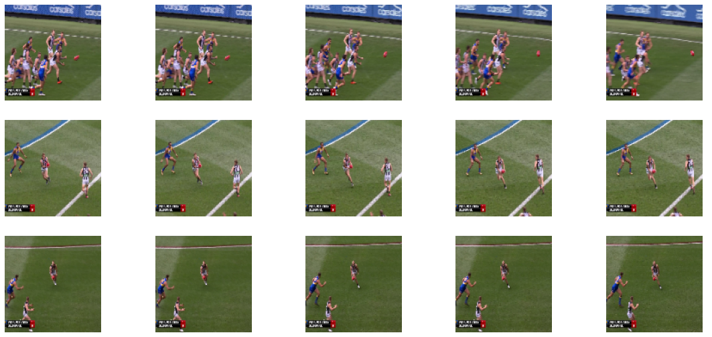

# AFL Action Recognition

This project creates a model to identify specific actions during the gameplay of Australian rules football. The model predicts the action being completed during each frame from a video of gameplay such as the frames shown below.

The model identifies the following actions:
* mark
* kick
* handball
* tackle

Training of the model is completed in the notebook: [01_model_train](01_model_train.ipynb)

The project uses the R(2+1)D model architecture and a pre-trained model on 65 million social media videos (from Instagram) presented in [Large-scale weakly-supervised pre-training for video action recognition (2019)](https://arxiv.org/abs/1905.00561) paper, and a PyTorch implementation from [Microsoft Computer Vision](https://github.com/microsoft/computervision-recipes/tree/master/contrib/action_recognition/r2p1d) .
